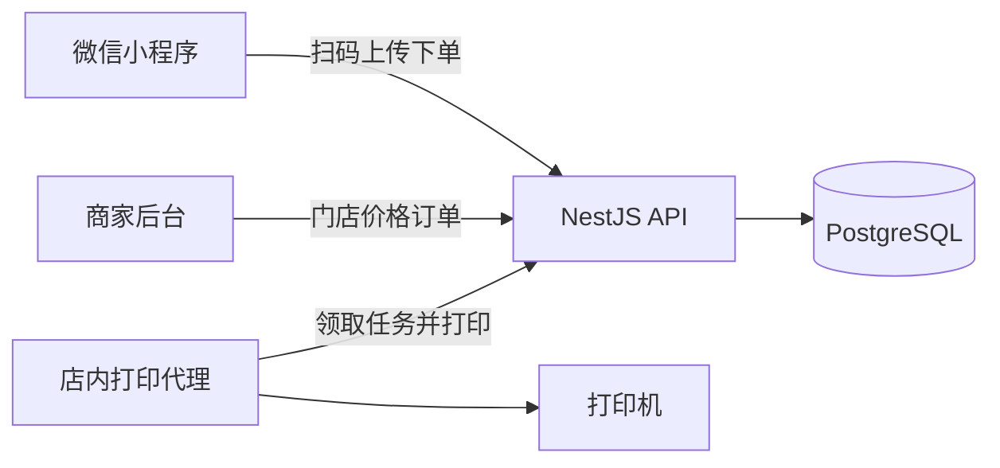

# 自助打印

顾客用微信扫店内进店码，上传文件、选规格、下单。商家在后台看订单。店里的打印代理把已支付任务打出来。

这一版的微信登录和支付是模拟的，方便先把进店、计价、下单、出纸跑通。



## 目录

- `apps/api`：NestJS + Prisma + PostgreSQL
- `apps/admin`：Next.js 商家后台
- `apps/miniprogram`：微信原生小程序
- `apps/agent`：店内打印代理

金额在接口里都是分。默认价格按文件页计：A4 黑白单面 ¥0.20/页，彩色 ¥1.00/页。双面是另一套每页单价。

## 本地启动

需要 Node.js 20+ 和 PostgreSQL 16。

```bash
docker compose up -d
cp apps/api/.env.example apps/api/.env
npm install
npm run db:setup
npm run dev
```

- API：http://127.0.0.1:3000/api
- 商家后台：http://127.0.0.1:3001

演示商家 `13800000000` / `admin123`。示例门店进店码 `DEMO01`。店内代理令牌 `agt_dev_demo_store_token`。

另开一个终端跑代理。默认是模拟打印，文件会落到 `apps/agent/printed/`：

```bash
cp apps/agent/.env.example apps/agent/.env
npm run dev:agent
```

`PRINT_MODE=system` 时改为调用本机 `lp`。系统打印机名要和后台里的「系统打印机名」一致，代理环境变量 `PRINTERS` 填后台里的店内名称。Office 文档在系统模式下会失败，这一版只直接打印 PDF 和图片。

## 顾客流程

1. 用微信开发者工具打开 `apps/miniprogram`（测试号即可，已关闭合法域名校验）。
2. 真机调试时，把 `apps/miniprogram/utils/config.js` 里的地址改成电脑局域网 IP。
3. 首页输入 `DEMO01`，或扫描后台门店页上的二维码。二维码内容是 `selfprint:store:DEMO01`。
4. 上传 PDF 或图片，选择黑白/彩色、单双面、纸张和页码，模拟支付。
5. 订单进入待打印。代理领取后，小程序订单会变成打印中，打完变成待取件。

小程序启动时用设备号调用 `POST /api/auth/customer/mock-login`，同一个开发者工具里的订单会留在这个模拟用户下。正式环境应换成 `jscode2session`，支付应换成微信支付，二维码应换成微信无限制小程序码。

## 商家后台

登录后可以开门店、改单价、添加打印机、生成代理令牌、查看和下载订单文件。待取件的订单可以确认取件。打印失败或需要再出一份时可以重新打印。

## 测试

```bash
npm test
```

API 测试会跑计价单测，并对 PostgreSQL 走一遍注册、上传、计价、模拟支付、代理领取和打完的链路。
